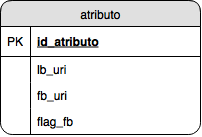

# Relation Between: LinkedBrainz Artist Entity - Facebook Artist Page *

Sharing data of the relation between the entities with types MusicArtist, MusicGroup and SoloMusicArtist from LinkedBrainz and its respective page on Facebook (when such page exists).

This repo is for sharing a dump of a table called 'atributo' in a relational database. This dumped table 'atributo' make the relation between the URIs of entities with types MusicArtist, MusicGroup and SoloMusicArtist collected from LinkedBrainz and the URIs of its respective page on Facebook (when such page exists).

The structure of the dumped 'atributo' table is showed below:

The 'lb_uri' attribute is the entity URI in LinkedBrainz and the 'fb_uri' attribute is the respective entity Facebook page URI (its value is null when there isn's a found page on Facebook for the entity).

* This contribution is the result of my final project for the Computer Science Bachelor Degree in UFRJ.
